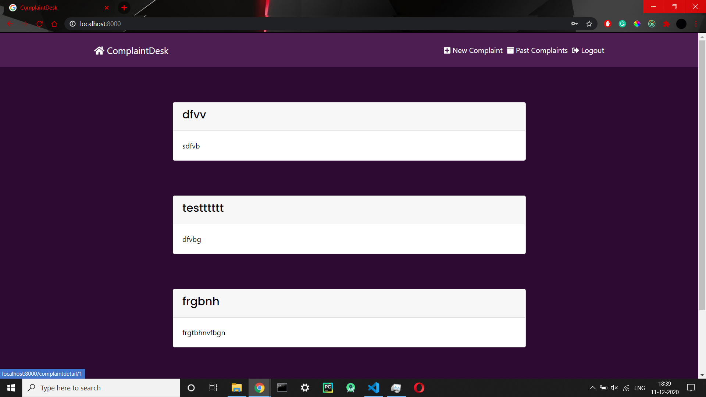

# ComplaintDesk

---
ShopsNearYou is a platfrom where people can register complaints regarding the problem they face, and the gov-employees on the other side can check that complaint and mark the complaint solved/pending according to its status.

# Features
    -Complaint author can Add/Update/Delete their complaints
    -User can check the list of their past complaints
    -user can filter the complanits according to area/topic
    -User has option to tag complaint with its location.
    -Location can be added via map (used mapbox for this) or by loading user's live location
    -login/signup (custom user model with reset_password/activation_link feature)
    -social authentication i.e. google,facebook,twitter.
    -providing our data statistics through apis as a service
    -website is completely responsive

### Screenshots
-User Registration Page

---

-Employee Registration Page

---

-Login Page

---

-Home Page

---
-Add Complaint Page

---

### Tech Stack
    -Django
    -Django REST
    -ReactJS
    -HTML
    -CSS
    -BOOTSTRAP

### Database 
    -postgresql
